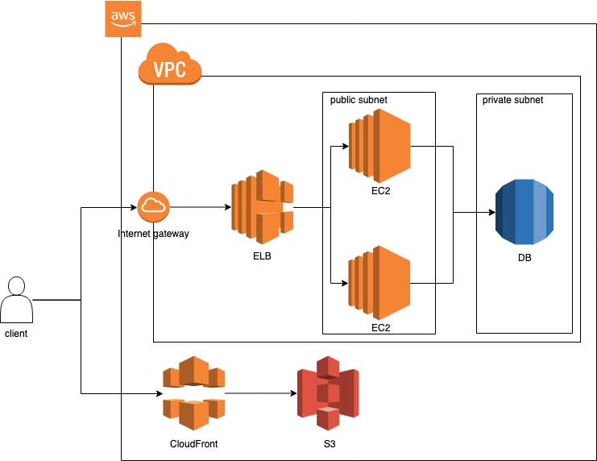

# nodejs-aws

## 환경 구성

- [git 설명](./etc/git.md)
- [node](./etc/node.md)
- [visual code](https://code.visualstudio.com/)

## 개념 설명

- [javascript](./etc/javascript.md)
- [http 상태 code](https://ko.wikipedia.org/wiki/HTTP_%EC%83%81%ED%83%9C_%EC%BD%94%EB%93%9C)
- [http 헤더 정리](https://www.zerocho.com/category/HTTP/post/5b3ba2d0b3dabd001b53b9db)
- [Web Server와 WAS](https://gmlwjd9405.github.io/2018/10/27/webserver-vs-was.html)
- [REST API](./etc/restApi.md)

## 일정

- 1주차: 개발환경 구성
- 2주차: express & node.js 구성
- 3주차: web application 구성
- 4주차: aws 구성 및 aws 서비스 소개
- 5주차: aws network 설정 및 DB 구성
- 6주차: EC2 생성 및 node 서버 배포
- 7주차: ELB 구성 및 web application 배포
- 8주차: CloudFront 구성 및 review